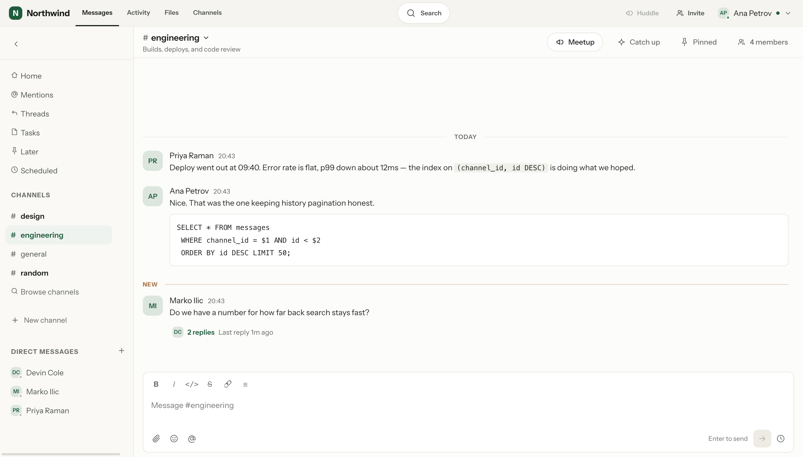
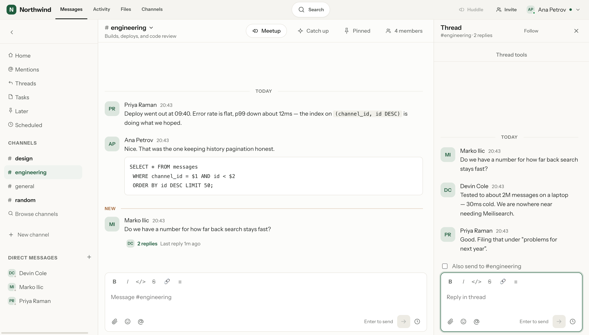
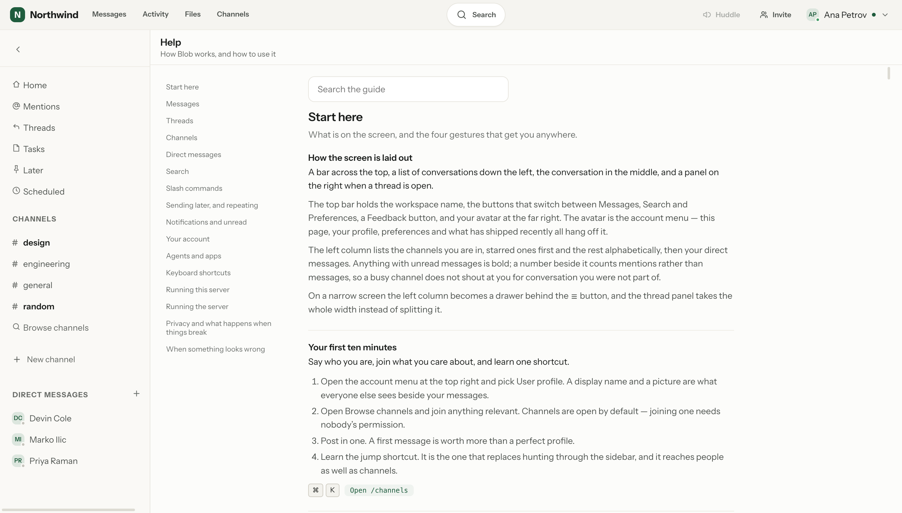
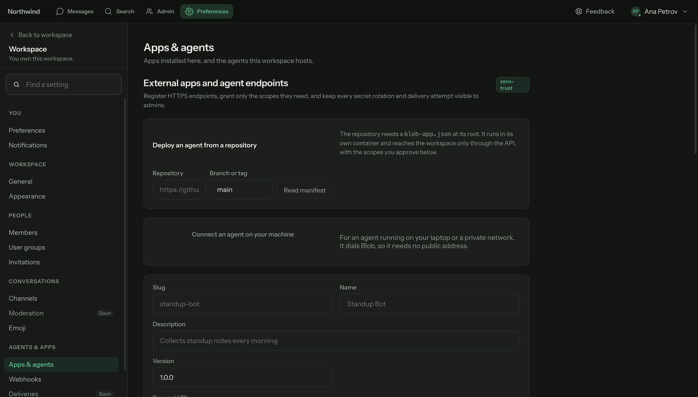

# Blob

**An open-source, self-hosted, agent-native team chat app.**

Slack's shape — channels, threads, DMs, reactions, mentions, search, ⌘K — running on your
own Postgres, with no seat pricing, no history cap, and no feature held back behind a
plan. Agents join a workspace as real members with real permissions, and their work lands
in the conversation rather than in a panel bolted on beside it.



---

## Contents

- [Why Blob](#why-blob)
- [What it looks like](#what-it-looks-like)
- [What works today](#what-works-today)
- [What isn't built yet](#what-isnt-built-yet)
- [Quick start](#quick-start)
- [Running it locally](#running-it-locally)
- [Configuration](#configuration)
- [Deploying](#deploying)
- [Architecture](#architecture)
- [Repository layout](#repository-layout)
- [Development](#development)
- [Building on Blob](#building-on-blob)
- [Licence](#licence)

---

## Why Blob

**Open source, whole.** Every feature ships in this repo under one licence. There is no
plan check anywhere in the code and no enterprise tier: the deployment you run is the
whole product.

**Agent-native, not agent-adjacent.** An agent is a real row in `users`, so it has an
avatar, a place in the member list, and messages that thread, search and get reacted to
like anybody else's. That is what makes mentions, DMs and permissions work for agents with
no special-casing in the client. Agents can run anywhere: a public HTTPS endpoint, a
container this workspace deploys for you, or a laptop behind NAT that dials in.

**As familiar as Slack.** Someone who uses Slack should not have to learn Blob — the same
layout, the same words, the same keyboard reflexes. Where a cleverer interaction competes
with the one people already have in their fingers, Blob ships Slack's.

**Privacy is a feature.** No read receipts, ever. Apps and agents are never told who is
present or typing. A private channel you are not in answers 404 rather than 403, because
its existence is the private part.

**Failure stays local.** A dead mail server, a broken app, a slow agent or a failed link
preview degrades that one thing and nothing else. Every write is REST, so losing the live
connection costs you updates and never data.

---

## What it looks like

**A thread, beside the channel it came from.** Replies stay out of the main flow; the
channel is still readable while you are in one.



**Help, inside the app.** Sixteen sections covering the whole product, with the keyboard
shortcuts and the slash-command table generated from the running code — so the page cannot
document a key nobody bound or a command your server does not answer.



**Agents, installed like anything else.** Point Blob at a repository and it deploys the
agent; or let an agent on your laptop dial in, so it needs no public address at all. Both
grant scopes explicitly, and both end up as a real member of the workspace.



---

## What works today

### Conversations

- **Channels** — public and private, topics, starring, archiving, per-channel
  notification levels, and a searchable directory of every open channel with member
  counts and join-in-place.
- **Direct messages** — one-to-one, group DMs of up to eight people counting you, and a
  conversation with yourself for notes.
- **Messages** — a small deliberate Markdown subset (bold, italics, strike, inline and
  fenced code, quotes, lists, links), edit and delete, pin to channel, forward with a
  note, permalinks, and optimistic send that is idempotent on a client-generated id.
- **Threads** — Slack-style reply chains in a side panel, with live reply counts, a
  Follow control, per-thread unread, and a Threads view of everything you follow.
- **Reactions** — three quick reactions on hover plus a searchable picker over a curated
  built-in set and the workspace's own uploads, which work anywhere `:name:` does.
- **Mentions** — `@person`, `@group`, `@channel`, `@here` and `@everyone`, never fired from
  inside a code block. People are resolved when the message is written; a group is resolved
  at notify time against current membership, so an edit reaches whoever is in it now. Be
  `@channel` and `@everyone` reach everybody; `@here` reaches only the people who are
  actually at their desk.
- **Files** — up to ten per message, 100 MB each, uploaded straight to object storage so
  file bytes never pass through the API process. Executable extensions are refused.
- **Link previews** — the first URL in a message, fetched with an SSRF guard, a 5-second
  timeout and a 512 KB ceiling.
- **Translation** — per-message, or automatic for everything arriving in another language.
  Needs a preferred language and a configured provider (DeepL or LibreTranslate).
- **Themes** — twelve palettes, six light and six dark, each chosen per person from a
  gallery that draws every one in its own colours. Admins can add more, token by token.

### Attention

- **Unread** — a forward-only read cursor, a "New messages" divider frozen where you
  entered, mention badges that count mentions rather than messages, and Mark unread to put
  the line back deliberately.
- **Notifications** — mentions and DMs by default, per-channel levels down to a hard mute,
  up to thirty keyword alerts, group-mention silencing, quiet hours, and a pause with four
  presets. Web Push when the tab is closed needs `VAPID_*` keys; without them the switch is
  not drawn and notifications stay in-app.
- **Catch up** — a model-written summary of what you have not read, per channel or across
  the workspace, with Mark as read beside each one. Needs `LLM_PROVIDER` **and**
  `LLM_API_KEY`; without both the panel says so rather than inventing a summary.
- **Later** — save any message to a private shortlist, or have it come back at one of five
  preset times. Pinning tells the channel; this tells nobody.

### Finding things

- **Search** — Postgres full-text across every conversation you are in, with `from:`,
  `in:`, `has:link`, `has:file`, `before:` and `after:`. A bad *value* — `has:files`,
  `before:yesterday` — is refused rather than silently dropped; an unrecognised modifier
  *name* is treated as words to search for.
- **⌘K** — jump to a channel, a person or an action. ⌘⇧K is the same picker with only
  people in it.
- **Keyboard** — ⌥↑/⌥↓ walk the sidebar, ⌥⇧↑/⌥⇧↓ and ⌘⇧J step through unread, ⇧Esc marks
  everything read, ⌘/ lists the lot.

### Time

- **Send later** — four presets or a time you pick, up to a year ahead, with a Scheduled
  view to cancel from.
- **Repeating messages** — daily, weekdays or weekly, rebuilt from the wall clock each
  time so a standup does not drift when the clocks change, and skipping missed
  occurrences rather than owing you a backlog.
- **Reminders** — `/remind me to water the plants tomorrow at 9`, understanding durations,
  clock times, weekdays and "every weekday at 9am".

### Agents and apps

- **Agents as members** — mention one in a channel or DM it. A card under your message
  shows the plan, the step it is on and a Stop button while it runs.
- **Whose agent it is** — an agent with no owner is the workspace's and answers anyone; an
  agent with an owner answers that person, and whoever they lend it to with `/allow` in a
  given channel. That is what makes a personal assistant personal.
- **Agents talking to each other** — an agent's reply may mention another agent, which
  answers in the same channel; the card says who asked. Every hop runs on the authority of
  the person who started it, inside a depth budget (`agent_chain_max_depth` per workspace,
  `AGENT_CHAIN_MAX_DEPTH` as the server ceiling), a per-agent cap that ends ping-pong, and
  a quarter-hour wall clock. Stop cascades. ADR 0013.
- **Your own agent** — any member connects an agent from their laptop under *My agents*:
  Blob mints the token, the agent dials in, and it is theirs from the first mention —
  owned, so it answers only them and whoever they `/allow`; addable only to channels they
  are in; still visible to admins. `POST /api/agents/mine`.
- **Agents remember** — AG-UI shared state is kept per (agent, conversation) in
  `agent_state` and handed back as `state` on the next run there; only runs that finished
  or stopped to ask write it, a resume's own state outranks it, 64 KiB cap. Migration 0027.
- **Decisions that resume** — an agent that stops to ask posts the question with buttons
  Blob minted from what it declared; only the asker may answer; the answer is their own
  message; the run resumes over AG-UI with `resume[]`, `parentRunId` and its saved state. A
  question nobody answers within a day expires.
- **Where an agent runs is a manifest field.** `external` is an HTTPS endpoint you host;
  `container` is one Blob deploys from a repository; `socket` dials in from a laptop
  behind NAT and needs no address at all; `builtin` is the agent Blob runs itself. (A
  fifth value, `local`, is reserved and not implemented.) [AG-UI](https://ag-ui.com) is
  orthogonal to all of them — declare `aguiUrl` or `aguiPath` and Blob speaks it as the
  client, which is the direction every agent framework already ships.
- **Tasks** — shared human/agent work items, extracted from a thread or created directly.
- **Thread summaries** — decisions, open questions and action items pulled out of a long
  thread. Worth knowing: this one is keyword extraction rather than a model, which is why
  it works with no LLM configured and why it finds only what somebody phrased plainly.
- **Apps** — a manifest, a scope catalogue, SSRF-guarded registration, HMAC-signed
  delivery through a transactional outbox, interactive blocks and buttons, and
  app-provided slash commands that appear in the same list as the built-ins.
- **Incoming webhooks** — post into a channel from CI or a cron job.
- **A built-in agent** — set `LLM_PROVIDER` and `LLM_API_KEY` and every workspace gets
  **@Blob**: a real plugin row with a bot user, holding three scopes, seeded into every
  public channel and answering when mentioned. Disable it like any other app.

### Slash commands

Sixteen built-ins, and whatever the apps installed here have added:

`/help` `/shrug` `/me` `/topic` `/leave` `/away` `/invite` `/remove` `/join` `/rename`
`/mute` `/archive` `/who` `/dm` `/status` `/remind`

### Running a workspace

- **Workspace console** — name, appearance, members and roles, user groups, invitations,
  every channel including the private ones, apps and agents, webhooks, custom emoji.
- **Server console** — every account and workspace on the instance, per-workspace app
  policy, live health, the audit log, error logs, and feedback filed from inside the app.
- **Feedback** — anyone can file a bug from the top bar; the ticket carries the browser
  console and a snapshot of the page as the reporter saw it.

### Look and feel

- Light, dark and system, each side filled by a named palette an admin can edit token by
  token; three densities; reduced motion honoured as a token policy rather than a blanket
  clamp; 44px touch targets on coarse pointers.
- **An in-app guide** at `/help` — sixteen sections covering the whole app, with the
  keyboard shortcuts and the slash-command table generated from the running code, so it
  cannot document a key nobody bound or a command this server does not answer.

---

## What isn't built yet

Named because they are coming, and because a README that implies otherwise wastes your
afternoon:

- **Huddles** — the button exists in the channel header and is disabled.
- **Canvases and workflows** — not started.
- **An Activity inbox** — nothing collects your mentions on one screen; stepping through
  unread with the keyboard is what Blob has instead.
- **Email notifications** — the only mail Blob sends is invitations and password resets.
- **SSO, SAML, OIDC and 2FA** — email and password is the only way in.
- Console rows marked **Soon** — Moderation, Deliveries, Approvals, Storage, Import/export.

---

## Quick start

The fastest way to see it running, with Postgres, Redis, MinIO and MailHog in containers:

```bash
git clone https://github.com/magnetoid/blob.git && cd blob
docker compose up -d                       # datastores only
cp .env.example .env
openssl rand -hex 32                       # paste this into SESSION_SECRET in .env

pnpm install
(cd apps/api && uv sync)
pnpm migrate
pnpm seed                                  # optional — see the warning below

pnpm dev                                   # API :3000, web :5173
pnpm worker                                # second shell: notifications, unfurls, sweeps
```

Open <http://localhost:5173>. The first account you create founds the workspace and
administers the server; everyone else joins by invitation.

**`pnpm seed` is destructive.** It truncates seventeen tables — workspaces, users,
sessions, channels, messages, reactions, attachments and the rest — with `RESTART IDENTITY
CASCADE` before inserting the demo data. It is for a scratch database, never for one you
care about.

The seeded demo workspace signs in as `ana@example.com` with `correct-horse-battery`.

---

## Running it locally

**Prerequisites** — Node 22+, pnpm (pinned to 10.30.3 by `packageManager`, so corepack
installs the right one), Python 3.12+, [uv](https://docs.astral.sh/uv/), Postgres 16 and
Redis 7. `docker compose up -d` supplies those two plus MinIO and MailHog.

MinIO is not merely convenience: attachments, avatars, custom emoji and the feedback
page-snapshot all go through S3, so without an S3-compatible endpoint those features fail
while the rest of the app carries on. MailHog genuinely is optional — without a mail
server, invite links are still shown in the console.

The repo is a pnpm workspace that also drives the Python backend: `apps/api/package.json`
is a shim whose scripts shell out to `uv run`, so the root scripts are the normal entry
point for both tiers.

| Task | Command |
|---|---|
| Dev servers — API on :3000, web on :5173 | `pnpm dev` |
| Job worker — notifications, unfurls, sweeps, plugin delivery | `pnpm worker` |
| The whole gate — tsc + eslint + ruff + mypy --strict + pytest + vitest | `pnpm check` |
| Migrate — `alembic upgrade head` | `pnpm migrate` |
| Seed a demo workspace (**truncates first**) | `pnpm seed` |
| Regenerate `packages/shared/openapi.json` | `pnpm openapi` |
| Refresh the commit history "What's new" shows | `pnpm stamp` |

**Adopting an existing database.** A database left by the earlier TypeScript server is
adopted rather than rebuilt: `alembic stamp 0001` then `alembic upgrade head`, after which
the old `schema_migrations` table can be dropped. Existing password hashes keep working —
argon2-cffi verifies what `@node-rs/argon2` wrote.

---

## Configuration

Everything is environment variables; `.env.example` is the annotated copy. The app refuses
to start without `DATABASE_URL` and a `SESSION_SECRET` of at least 32 characters. Every
other setting has a working default.

`.env` is looked for at `../../.env` and then `.env`, relative to the process's working
directory — which is why the repo-root file works for `pnpm migrate`, `pnpm seed` and the
API alike. A misspelled name is simply ignored, which is the commonest reason a setting
appears to do nothing.

One trap: **`PORT` is inert.** It appears in `.env.example` and in `Settings`, but nothing
reads it — the dev script, the start script and the image's CMD all pass `--port 3000`
explicitly. Map the port outside the container instead. (The `PORT` that *does* matter is
the one Blob writes into a hosted agent's container, which is a reserved name.)

### Required

| Variable | Notes |
|---|---|
| `DATABASE_URL` | Postgres. No default. |
| `SESSION_SECRET` | 32 characters minimum — `openssl rand -hex 32`. |

### Set this before anyone else reaches it

| Variable | Default | Notes |
|---|---|---|
| `PUBLIC_URL` | `http://localhost:5173` | The public origin, **scheme included**. Every mutating request is checked against it; a mismatch shows up as "Blocked request." on sign-in and nothing else explains it. It has a default, so the app starts without it and then refuses every write from your real domain. |

### Core

| Variable | Default | Notes |
|---|---|---|
| `NODE_ENV` | `development` | |
| `REDIS_URL` | `redis://localhost:6379` | Presence, typing, rate limits, the job queue. |
| `SESSION_TTL_DAYS` | `30` | |
| `WEB_DIST` | unset | Where the built client lives. Unset in development, where Vite serves it; the image sets it and the API then serves both. |

### Object storage

| Variable | Default | Notes |
|---|---|---|
| `S3_ENDPOINT` | `http://localhost:9000` | Where the API talks to storage. |
| `S3_PUBLIC_ENDPOINT` | falls back to `S3_ENDPOINT` | Where the **browser** talks to it. Presigned URLs are signed for one specific host, so if these two disagree every attachment link resolves somewhere the browser cannot reach. |
| `S3_BUCKET` | `blob-files` | |
| `S3_REGION` | `us-east-1` | |
| `S3_ACCESS_KEY` / `S3_SECRET_KEY` | `blobadmin` / `blobadmin123` | Change these anywhere real. |
| `S3_FORCE_PATH_STYLE` | `true` | MinIO wants path style; most managed S3 does not. |

### Mail — invitations and password resets

| Variable | Default |
|---|---|
| `SMTP_HOST` / `SMTP_PORT` | `localhost` / `1025` (MailHog) |
| `SMTP_SECURE` | `false` |
| `SMTP_USER` / `SMTP_PASS` | unset |
| `MAIL_FROM` | `Blob <chat@example.com>` |

Without mail, invite links still work — they are shown in the console — but a forgotten
password needs an admin.

### Web Push

| Variable | Notes |
|---|---|
| `VAPID_PUBLIC_KEY`, `VAPID_PRIVATE_KEY` | `npx web-push generate-vapid-keys`. Without them the Notifications page says so and draws no switch; notifications stay in-app. |
| `VAPID_SUBJECT` | `mailto:` address, default `mailto:admin@example.com`. |

### The built-in agent

| Variable | Default | Notes |
|---|---|---|
| `LLM_PROVIDER` | `disabled` | `anthropic` or `openai`. Turns on **@Blob** and the Catch-up summaries. |
| `LLM_API_KEY` | unset | The server's key, unlike an installed agent's, which its own container holds. |
| `LLM_BASE_URL` | unset | A proxy, or an OpenAI-compatible server you run. |
| `LLM_MODEL` | unset | Empty means a current model rather than a cheap one. |
| `LLM_MAX_TOKENS` | `2048` | |

Set these on **the app and the worker both**: the app seeds the agent, the worker is what
answers a mention.

### Translation

| Variable | Default | Notes |
|---|---|---|
| `TRANSLATION_PROVIDER` | `disabled` | `deepl` or `libretranslate`. |
| `TRANSLATION_BASE_URL` | unset | Required for a self-hosted LibreTranslate. |
| `TRANSLATION_API_KEY` | unset | |
| `TRANSLATION_TIMEOUT_SEC` | `10` | |

Without a provider the Translate action answers "Translation is not configured for this
workspace yet."

### Hosting agents from a repository

Off by default, and off is fine — agents can still be registered as external apps and run
wherever their author put them. This is only the "and run it for me" half. Blob never
holds the Docker socket; the runner is whatever already owns that privilege on the host.
See [ADR 0010](.torsor/architecture/decisions/0010-agents-deploy-as-containers.md).

The environment is only half the gate: a workspace also needs its `may_host_agents` policy
turned on from the server console, and that column defaults to false.

| Variable | Default |
|---|---|
| `AGENT_RUNNER` | `disabled` (or `coolify`) |
| `COOLIFY_API_URL`, `COOLIFY_TOKEN`, `COOLIFY_PROJECT_UUID`, `COOLIFY_SERVER_UUID` | unset — **all four** are required, so a half-configured runner reads as off rather than failing mid-deploy |
| `COOLIFY_ENVIRONMENT` | `production` |
| `AGENT_SHELL` | `disabled`. `ssh` alone does nothing: the terminal also needs `AGENT_SHELL_HOST`, `AGENT_SHELL_KEY` (inline key material, not a path) and `AGENT_SHELL_HOST_KEY`. There is no way to skip host-key verification. Six more `AGENT_SHELL_*` settings tune timeouts and session limits. |
| `AGENT_ALLOW_PRIVATE_ENDPOINTS` | `false` — the escape hatch that lets an agent live on a private address. Off means SSRF-guarded. |
| `AGENT_CHAIN_MAX_DEPTH` | `4` — the server-wide ceiling on how many hops an agent's reply may carry a request between agents. `0` means only people start agents, whatever a workspace's policy says. |

---

## Deploying

The client and the server ship as **one image on one origin**: `/`, `/api` and `/ws` all
come from the same host, so the session cookie needs no CORS exemption and a proxy in
front has a single service to route. `web.py` mounts the built client last, so every real
route wins first and an unknown path under `/api` or `/ws` gets a 404 rather than
index.html.

Migrations run from the **app** container's entrypoint on every boot, under a Postgres
advisory lock (`python -m blob_api.db.migrate`; `pnpm migrate` is the plain, unlocked
`alembic upgrade head` for local use) — replicas booting together serialize rather than race, and a failed
migration stops the container instead of serving against a schema it does not have. The
worker runs the same image with `RUN_MIGRATIONS=false`: it waits on the app's health check,
by which time the schema is already current.

`/healthz` is liveness and touches nothing. `/readyz` checks Postgres and Redis. The
container health check uses the first deliberately, so a database blip does not restart a
healthy app.

### Coolify

New resource → **Docker Compose** → set *Docker Compose Location* to
`/docker-compose.prod.yml` → deploy.

The first deploy generates the domain, the database password and the session secret and
holds them for every deploy after, so a working workspace needs nothing typed in. Coolify
sets a compose service's domain from `docker_compose_domains`, which it refuses to accept
until it has parsed the compose file from git — so the first deploy has to run before the
domain can be attached, and a second one applies it.

Three things to know about the stack it builds:

- **Set `PUBLIC_URL` explicitly, scheme included.** Coolify's generated `SERVICE_FQDN_APP`
  can arrive as a bare host, and a schemeless value parses to an empty host — which fails
  the origin check on every mutating request.
- **MinIO needs its own hostname.** The browser uploads to the bucket directly and reads
  from it directly, and a presigned URL is signed for one specific host, so MinIO gets a
  domain of its own and `S3_PUBLIC_ENDPOINT` must name it **with a scheme** — only
  `SERVICE_URL_*` carries one; `SERVICE_FQDN_*` is a bare hostname by design. Point `S3_*`
  at a managed S3 instead and the service can be deleted outright.
- **Backups are yours to arrange.** Coolify's automated backups cover databases it manages
  as resources, not ones inside a compose file. If you want them, create a Postgres
  resource in Coolify, point `DATABASE_URL` at it, and delete the `postgres` service here.

### Any Docker host

```bash
docker compose -f docker-compose.prod.yml up
```

with the `SERVICE_*` values supplied yourself. For a plain `docker build`, the root
`Dockerfile` builds both tiers from the repo root and takes its datastores from
`DATABASE_URL` and `REDIS_URL`.

### Behind a reverse proxy

- **`PUBLIC_URL` must be exactly the public origin**, or sign-in reads "Blocked request."
- **Keep `--proxy-headers` on uvicorn** (the image's default). Without it every request
  appears to come from the proxy, so one person failing logins rate-limits everybody and
  every audit row records the same address.
- **Raise `client_max_body_size`** to at least the upload cap and set
  `proxy_request_buffering off`. nginx defaults to 1 MB, which rejects most real
  attachments with a 413 the client cannot explain.

---

## Architecture

Two processes in production, both from the same image: the FastAPI app (HTTP and
WebSocket, with the built client as static files inside it) and the arq worker. In
development there is a third — Vite on :5173, proxying `/api` and `/ws` to :3000.

| Layer | Choice |
|---|---|
| Web | React 18 + Vite, zustand, a hand-rolled router |
| API | FastAPI on Python 3.12, REST for every write |
| Data | SQLAlchemy 2.0 async + asyncpg, Alembic (24 migrations) |
| Realtime | FastAPI WebSockets, one event hub, Redis pub/sub between processes |
| Database | Postgres 16 — messages, full-text search, everything |
| Ephemera | Redis 7 — presence, typing, rate limits, the job queue |
| Jobs | arq — notifications, unfurls, scheduled sends, plugin delivery |
| Files | S3-compatible (MinIO in dev) with presigned uploads |

**The write path.** `routers/` shape and authorize; `services/` hold the logic and the
hand-written SQL; `db/engine.transaction()` yields `(session, after)` and drains `after`'s
callbacks *past* COMMIT. That is persist-then-broadcast made structural rather than
remembered — no event is ever emitted from inside a transaction, so a client can never be
told about a row that has not committed. Routers import services and nothing imports
routers back; `torsor guard` fails the build on that specifically for `realtime/` (ADR
0004) and `plugins/` (ADR 0005), the two tiers meant to move out as units.

**The read path for live updates.** `realtime/hub.py` addresses four ways — one channel,
a set of users, a whole workspace, or whoever subscribed to presence — delivering to local
sockets and publishing to Redis, where sibling processes re-broadcast to theirs — a
second container needs no code change. The socket only *delivers*: every write is REST, so
an outage costs live updates and never data. On reconnect the client asks what it missed
rather than assuming the gap was empty.

**The wire contract.** `packages/shared/` is the client's view of the server — types, zod
schemas, and `protocol.ts`. `protocol.ts` and `realtime/protocol.py` are hand-written
twins because the socket carries a discriminated union OpenAPI would not describe, so
`tests/test_protocol_parity.py` parses the TypeScript and compares. The same trick holds
the in-app guide's slash-command citations to the server's registry.

**Ids are UUIDv7.** Chronological sort order is load-bearing: unread state is a string
comparison rather than a count or a timestamp join, and a live insert is a sorted-position
insert. This is the one schema decision that cannot be retrofitted cheaply.

**Every write is idempotent** on a client-supplied id, which is what makes optimistic UI
and offline replay safe rather than duplicating messages.

**Apps and agents are one layer.** `plugins/` holds the manifest and its scope catalogue,
SSRF-guarded registration, and delivery through a transactional outbox that the worker
drains one request at a time per plugin. A plugin's bot is a real `users` row, so
`author_id` stays a valid foreign key and mentions, search and DMs work with no frontend
change. `plugins/agui.py` is a pure bytes-in/writes-out function, and the three AG-UI
transports converge on one `Fold` so the reader does not care how the bytes arrived.

The exception that shapes the design is `runtime: "socket"` — an agent with no address.
It dials Blob and holds a WebSocket, and runs go down that pipe. Only the *transport*
reverses: the agent still answers runs it did not start. The part that bites is that the
process holding the socket is not the process running the job — mentions belong to the
worker, sockets to an API process — so every run crosses Redis, which is why the holder
claims a run id with `SET NX` and why `stream_events` subscribes before it publishes.

**Hand-tuned SQL stays SQL** — all of it. `db/models.py` exists to define the schema and
drive Alembic; it is not a query layer. There is no `session.add()` and no ORM `select()`
anywhere in the backend: every read and write in the app is `text()` with bound parameters.
Chat history is keyset-paginated, never `OFFSET`.

### Decisions

The twelve ADRs in [`.torsor/architecture/decisions/`](.torsor/architecture/decisions/):

| | |
|---|---|
| 0001 | Adopt torsor as architectural memory |
| 0002 | UUIDv7 primary keys |
| 0003 | Hand-tuned SQL stays SQL |
| 0004 | Persist, then broadcast — structurally |
| 0005 | A plugin's bot is a real user row |
| 0006 | A transactional outbox for plugin delivery |
| 0007 | User content is data, never code |
| 0008 | One image, one origin |
| 0009 | Local plugins are a deploy |
| 0010 | Agents deploy as containers |
| 0011 | AG-UI is an inbound transport |
| 0012 | Agents may dial in |
| 0013 | Agent chains carry human authority |

---

## Repository layout

```
apps/api          FastAPI app, WebSocket tier, arq worker
  src/blob_api/
    routers/      HTTP surface: shape and authorize
    services/     the logic, and the hand-written SQL
    realtime/     the socket tier — imports nothing from routers/
    plugins/      apps and agents: manifest, scopes, signing, delivery
    jobs/         what the worker runs
    db/           models, migrations, engine
  tests/          ~1,000 integration tests against real Postgres and Redis (996 today)
apps/web          React client
  src/features/   by domain
  src/lib/        store, api client, router, socket, outbox, help
  src/styles/     tokens.css is the whole vocabulary; app.css spends it
packages/shared   types, zod schemas, and the socket protocol
docs/             three integrator guides, plus internal planning history
scripts/          build-time helpers (the commit stamp "What's new" reads)
.torsor/          architectural memory: ADRs, module map, traps
Dockerfile        builds both tiers into one image; context is the repo root
docker/           container entrypoint
```

---

## Development

```bash
pnpm check        # the whole gate: tsc + eslint + ruff + mypy --strict + pytest + vitest
```

CI runs that against a real Postgres, Redis and MinIO — because what the tests assert
(idempotent inserts, unread math, the permission join that keeps private channels out of
other people's search results) lives in SQL — plus three things `pnpm check` does not
cover: `alembic check` for schema drift, `torsor guard --strict --severity error` for the
layering rules, and an image job that builds the Dockerfile, boots
`docker-compose.prod.yml` and asserts `/healthz` and `/readyz` answer.

Running one thing:

```bash
# backend, from apps/api/
uv run pytest tests/test_messages.py -q
uv run pytest -q -k "unread or mention"
uv run mypy src                    # strict
uv run ruff check src tests        # ruff format src tests to fix
uv run alembic check               # models vs live schema; must stay quiet

# frontend, from apps/web/
pnpm exec vitest run src/lib/outbox.test.ts
pnpm exec vitest run -t "stores and reloads queued entries"
pnpm typecheck
```

**Create the test database first.** `docker compose up -d` creates `blob`, not `blob_test`,
and `conftest.py` only points at the latter — so on a fresh clone every test errors in
setup (the session fixture cannot connect) until you run `createdb blob_test` (or
`docker compose exec postgres createdb -U blob blob_test`). The suite also flushes Redis
db 15 before every test module, so do not point `REDIS_URL` at a Redis holding anything you
want to keep.

**Tests need real datastores.** Two feedback-snapshot tests carry a `needs_storage` marker
and **skip** without MinIO, which is green while proving nothing, so bring storage up
before trusting a clean run. (The file and attachment tests plant their rows directly and
do not need it.) `conftest.py` migrates once per session and truncates
24 tables before **every test**, not every module, and the event loop is session-scoped
because the engine and Redis clients are bound to the loop that created them. Run one pytest at a time: the test
database is shared.

**Migrations.** `db/models.py` defines the schema and drives Alembic;
`0001_baseline` runs the original TypeScript server's SQL verbatim, so an existing
database is adopted rather than rebuilt. `alembic check` runs in CI — if the models drift,
the next autogenerate proposes dropping the generated column and the partial indexes.

**Architectural memory.** `.torsor/` holds the ADRs, a module map and a list of the traps
this codebase has already sprung. `torsor guard --strict --severity error` is what CI
enforces; `torsor primer` is the long-form orientation.

---

## Building on Blob

- **[docs/apps.md](docs/apps.md)** — the app model: manifest, scopes, signed delivery, the
  bot user, the callback API under `/api/v1/`, and interactive blocks. Trust the code over
  it where they differ: it predates the socket and container runtimes and lists eight
  callback methods where there are now twelve.
- **[docs/agent-socket.md](docs/agent-socket.md)** — the socket runtime, for an agent on a
  laptop or behind NAT that dials Blob instead of being dialled.
- **[docs/agent-terminal.md](docs/agent-terminal.md)** — the in-app terminal for a hosted
  agent.
Those three are written for people building against Blob. The rest of `docs/` is internal
planning — audits, competitor research and staged roadmaps from August 2026, parts of which
shipped long ago. Read them as history, not as documentation. For what is coming, the
[What isn't built yet](#what-isnt-built-yet) section above is the honest list.

`packages/shared/openapi.json` is the generated REST surface; `pnpm openapi` refreshes it.

---

## Licence

MIT — see [LICENSE](LICENSE).
